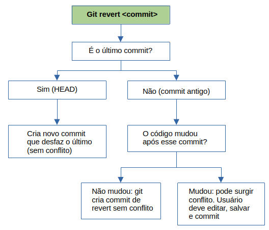
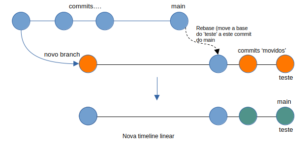

<!--
" Badges ------------------ {{{
-->
<!-- Estes badges só funcionarão quando o repositório do github for público -->
 
 
 


 
<!--
" }}}
-->
<!--
" Sumário ----------------------- {{{
-->
### Sumário

- [Introdução](#introdução)
- [Definições](#definições)
- [Merge Tools](#merge-tools)
- [Criação de Projeto](#criação-de-projeto)
- [Comandos Úteis](#comandos-úteis)
- [Ferramentas Gráficas](#ferramentas-gráficas)

---
<!---
" }}}
-->
<!--
 " Introdução --------------------------- {{{
-->
## Introdução 

Este guia descreve os passos recomendados para criar um projeto versionado com Git, conectado ao GitHub - ideal para projetos Ansible ou qualquer outro.

<sub>[⬆](#sumário)</sub>
---
<!--
" }}}
-->
<!--
" Definições --------------------- {{{ 
-->
## Definições

#### Características do Github: 

O Github, além de servir como repositório de projetos e controle de versionamento, tem um funcionamento semelhante a uma rede social, é possível seguir projetos (__star__), ou criar cópias de projetos (__fork__) para poder fazer alterações sem mudar o projeto principal.  

Após fazer o __fork__ de um projeto, ele ainda pode ser atualizado conforme o projeto original, através de _git pull_ ou via Github. 

O Github permite a abertura de __Issues__ (problemas), onde os colaboradores podem informar questões a serem corrigidas. 

Nas _Issues_ criadas o dono do repositório pode adicionar _labels_ e _milestones_, semelhantemente ao _GitLab_.

#### Arquivo README.md: 

Este arquivo, que não é obrigatório, pode estar na raiz do repositório, com o objetivo de documentá-lo, bem como podem existir outros README.md em outros diretórios. 

Ele usa sistema de marcação _.md_, e um recurso interessante para ajudar a escrever o arquivo é a plataforma [Dillinger](https://dillinger.io).

#### Estados de um arquivo no Git:   

- _Untracked_: não rastreado (logo após ser criado ou modificado)

- _Staged_: após ser adicionado ao Git (_git add file_)

- _Unmodified_: após o commit, se não foi mais alterado (_git commit -m 'xx'_)

- _Modified_: arquivo editado após o commit (se as edições forem desfeitas (_git restore file_), volta ao 'unmodified'; se forem mantidas e usar '_git add file_', volta a 'staged')

O arquivo também pode retornar à 'untracked' caso rode '_git rm --cached file_'.

Um arquivo pertence à apenas um estado por vez, mas diferentes arquivos podem estar em estados distintos simultaneamente. 

#### Branches: 

São ramificações de projetos que permitem o desenvolvimento de outras funcionalidades ao mesmo tempo em que um histórico principal é mantido. 

Por exemplo, em um projeto surge a necessidade de desenvolver uma funcionalidade de cadastro de usuários; pode-se então criar a _branch_ _cad-users_ a partir da _branch main_. Caso seja necessária outra funcionalidade independente dessa última, cria-se outro _branch_ _func-extra_ também a partir do _main_. 

Neste exemplo, cada _branch_ é independente das outras, e as alterações não afetam as demais. 

No momento em que se deseja mesclar o trabalho de um _branch_ ao histórico principal (_main_), é usado o comando __git merge branch__ -, e o _branch main_ absorve as alterações.

#### DETACHED HEAD: 

Em situações em que usamos _git checkout <commit_hash>_, para ver o estado do projeto naquele ponto (naquele _commit_ específico), o Git nos move do _branch_ atual para aquele _commit_ específico. Nessa situação, não estaremos dentro de um _branch_, mas em um 'limbo' dentro do projeto - o _DETACHED HEAD_. 

Ele tem esse nome, pois, como o _commit_ mais recente recebe a marcação _HEAD_, neste caso o _HEAD_ fica separado ou 'destacado' de um _branch_. 

No _DETACHED HEAD_, existem duas possibilidades: 

- Não são feitas alterações, ou, se feitas, são descartadas, apenas usando ```git switch <branch>```, mesmo se já houve _commit_; 

- Caso se queira salvar alterações, é preciso criar outro _branch_, após já estar no _detached head_:

    - Fazer as alterações;
    - Criar um novo _branch_: ```git switch -c <branch-head>```
    - ```git add <files> | git commit -m 'xx'```  
    Agora, as alterações estão salvas no _branch branch-head_.
    - ```git push [--set-upstream] <origin> <branch-head>```

#### Merge: 

O __merge__ é um dos principais comandos do _git_, que faz a 'união' entre um _branch_ em outro _branch_, que pode ser ou não o _main_. 

O _merge_ sempre deve ser executado no _branch_ de destino; o conteúdo de um _branch_ é mesclado no _branch_ atual.  

A realização do _merge_ não faz o _push_ para o servidor, é apenas local. 

##### Passo a passo para execução de merge: 

Partindo do _branch_ _main_, com _commit_ executado:

- Fazer alterações (criar diretório, criar arquivo, alterar arquivo):
- Criar novo _branch_, caso necessário: 
  ```
  git switch -c teste-rede
  ```
- Verificar as alterações 
- Caso positivo, fazer _commit_:
  ```
  git commit -m "ambiente de teste de rede"
  ```
- Voltar ao _branch_ que receberá o _merge_:
  ```
  git switch -
  git merge teste-rede
  ```
  * Antes de fazer o _merge_, o git abrirá o editor de texto para comentar, se não for comentado, _não será feito o merge_.

A realização do _merge_ não faz o _push_ para o servidor.

##### Conflitos no merge: 

Podem ocorrer conflitos entre _branches_ ao fazer um _merge_, p. ex., se um arquivo possui edições distintas num mesmo trecho. 

Ao tentar fazer o _merge_, o git mostrará a mensagem de erro e o arquivo mostrará linhas como as abaixo: 
```
Badges ------------------ 
<<<<<<< HEAD
linha 4: ernani     # status no 'main'
=======
linha 4: rodrigo    # status no 'devel-teste'
>>>>>>> devel-teste
```

As opção de solução são: 

- Desistir do _merge_: 
```
git merge --abort  # ou
git reset --hard
```

- Caso o conflito seja em poucas linhas de um arquivo, pode-se editá-lo diretamente o manter apenas o conteúdo desejado, eliminando as linhas com '<<<<<<<', '>>>>>' e '======='. 
  * Após, é preciso rodar novamente ```git add .``` e ```git commit -m ''```

  - Caso haja mais conflitos num arquivo, pode-se usar as ferramentas disponíveis para gerenciar conflitos em _merge_: 
    - Meld: 
    ```
    git config --global merge.tool meld
    git mergetool
    ```

    - [P4merge](https://www.perforce.com/products/helix-core-apps/merge-diff-tool-p4merge): binário, não instalável, modo gráfico

    - Vimdiff: app do Linux

    - Fugitive.vim: plugin do Git para Vim

  - Melhores ferramentas testadas: Meld (instalável) e P4merge (p4v - binário).

#### Configurações do Git:

Exemplo de arquivo de configuração: 

```
   $ >  git config -l
 init.defaultbranch=main
 credential.helper=store
 user.name=Ernani Kern
 user.email=ernani.kern@gmail.com
 credencial.helper=store
 mergetool.prompt=false
 mergetool.p4merge.cmd=/home/ernani/p4v-2025.2.2796382/bin/p4merge $BASE $LOCAL $REMOTE $MERGED
 mergetool.p4merge.path=/home/ernani/p4v-2025.2.2796382/bin/
 merge.tool=p4merge
 core.editor=vim
 core.repositoryformatversion=0
 core.filemode=true
 core.bare=false
 core.logallrefupdates=true
 remote.origin.url=https://github.com/ernanikern70/Git-Tutorial.git
 remote.origin.fetch=+refs/heads/*:refs/remotes/origin/*
 branch.head-teste.remote=origin
 branch.head-teste.merge=refs/heads/head-teste
 alias.lo=log --oneline
 alias.sw=switch
 alias.ps=push
 alias.pu=pull
 alias.l=log
 alias.s=status
 alias.cam=commit -am
  ```
* O app 'p4merge' não é instalado, então é preciso informar o 'path' e 'cmd'; se for um app como _vimdiff_ ou _mold_, basta informar 'merge.tool'

Todos os itens acima são configuráveis com:
```
git config <item>.<parâmetro> <valor>
```
E pode-se apagar uma configuração com: 
```
git config --unset <item>.<parâmetro>
```

#### Pull Request (PR):

O _pull request_ é uma solicitação de alteração num projeto, p. ex., de alterações feitas num _fork_ para o projeto original. Pode-se enviar vários _commits_ num _pull request_.  

Caso aceita, o responsável pelo projeto original executa um _merge pull request_ via Github. 

#### Segurança no Github: 

A plataforma permite autenticação via usuário e senha, ou via SSH, esta última sendo mais recomendada. Para usá-la, é preciso adicionar uma chave pública no Github:  

- No Github - code - SSH - 'add a new public key', _ou_
    - Ícone do usuário - settings - SSH and GPG keys

- No PC, criar as chaves pública e privada: 
    ```
    ssh-keygen
    ```
    O comando irá pedir nome e localização do arquivo, pode-se deixar o default, e passphrase, pode-se deixar em branco. 

- Copiar todo o conteúdo da chave .pub e colar no Github, incluindo um título qualquer

- Adicionar a chave privada ao SSH no PC:
  ```
  ssh-add ~/.ssh/<chave>
  ```

Após fazer essa alteração, a _url_ do repositório deve ser alterada para:   
```git@github.com:<user>/<repo.git>```

#### Tags: 

Funcionam como ponteiros, assim como o _HEAD_ e _main_. _Tags_ podem apontar para _commits_ específicos, que representem algum marco no projeto. 

Também são bastante usadas para marcar números de versões, que também incluem o uso acima. 

Como também são ponteiros, __as tags podem ser usadas no lugar dos hashes de commits em vários comandos__. 

Criação de _tags_: 
```
git tag v0.1
```
* Os nomes de tags devem ser únicos. 
* A tag acima é chamada de '_lightweight_'.

```
git tag -a -m "Tag criada v0.2" v2
```
* A tag acima é chamada de '_annotated_', que marca seu autor, comentário, data

#### Git stash: 

O _stash_ é uma funcionalidade do git que permite salvar em memória alterações que não estão prontas para _commit_, para que seja possível trabalhar em outro _branch_, por exemplo. 

Estando no _branch_ de trabalho, com as alterações feitas (estas precisam ser rastreadas), para incluir no _stash_: 
```
git stash
```

Pode-se criar vários _stashes_ no projeto. 

Para checar a lista:
```
git stash list
```

Para aplicar as mudanças do _stash_: 
```
git stash apply [stash@{n}]
```
* Isso deixa o git no estado anterior, é preciso continuar com o 'git add|commit'.
* Se o _stash_ não for informado, será aplicado o primeiro da lista.  
* O apply __não remove o stash da lista__.

Para aplicar e remover da lista:
```
git stash pop [stash@{n}]
```

##### Passo a passo do _stash_:

  ```
  git init stash-teste  # novo repositório por segurança
  cd stash-teste
  echo "linha 1" >> arquivo.txt
  git add arquivo.txt
  git commit -m "commit inicial"
  ```

  Acima, foi criado, adicionado e commitado o projeto. 

  A seguir, editar o arquivo: 

  ```
  echo "linha 2 (nova)" >> arquivo.txt
  ```

  Agora o arquivo está editado, e não foi feito '_add_', mas ele já é _modified_ (portanto, rastreado) pelo git. 

  ```
  git stash push -m "Adicionei linha 2"
  ```
  * O 'push' permite incluir um comentário, para deixar o _stash_ mais legível, senão, ele sempre receberá o mesmo comentário do último _commit_.  

  A partir desse comando acima, se rodarmos ```cat arquivo.txt```, o retorno será apenas ```linha 1```. 

  Verificar a lista: 
  ```
  git stash list
  ```

  Para ver o conteúdo guardado: 
  ```
  git stash show -p stash@{0}
  ```

  Testar __sem apagar__ o _stash_: 
  ```
  git stash apply stash@{0}
  ```

  Agora o arquivo voltou a ter a "linha 2".  

  Para __aplicar e apagar__ o _stash_: 
  ```
  git stash pop stash@{0}
  ```

  _Arquivos não rastreados não vão para o stash_. Para incluí-los, usar: 
  ```
  git stash push -u -m "Incluindo arquivos novos"
  ```

#### Sobre alterações em _commits_:


- __git revert <hash>__ → Cria um novo _commit_ que desfaz o _commit_ indicado. Histórico fica limpo, sem apagar nada.

- __git reset --hard <hash>__ → Move o ponteiro do _branch_ para trás, apagando _commits_ posteriores.

- __git reset --soft <hash>__ → Volta no tempo, mas mantém alterações no _staging area_.

- __git switch <branch>__ → Trás o estado de outro _branch_, útil para restaurar ou navegar.

- __git checkout <commit/arquivo>__ → Retorna ao estado de um _commit_ ou arquivo.

###### Por que ocorrem conflitos no _revert_: 



#### Git pull

Este é o comando para trazer um repositório remoto para a máquina local.  

Por padrão, ele faz um '_git fetch + git merge_', ou seja, se o repositório remoto tiver alterações ausentes no repositório local, e o repositório local tiver outras alterações ausentes no remoto, desde que não sejam conflitantes (nas mesmas linhas do mesmo arquivo), as alterações locais _não serão perdidas_, como ocorreria com o _git push_, por exemplo. 

Caso as diferenças sejam conflitantes, então deverá ser tratado manualmente.  

#### Rebase

Em projetos onde há fluxos de colaboração com vários _branches_, é comum ocorrer situações onde um colaborador cria um _branch_ de testes, a partir de um _commit_ do _main_, por exemplo, e após isso o _main_ segue recebendo _commits_. 

No momento em que esse colaborador, após ter feito alguns _commits_ no _branch_ de testes, fizer um _merge_ no _main_, este último estará num ponto mais adiantado em relação ao da origem do _branch_ teste, e esse _merge_ criará o que chamamos '_merge de commit_', deixando o histórico '_não linear_', conforme figura abaixo: 


Visualizando _branches_ não lineares pelos logs: 

Na primeira imagem, o _branch_ _main_ teve 2 _commits_ a partir de _origin_, onde foi criado o _branch teste_; no meio, o _branch teste_ também teve 2 _commits_ após o _commit zerado_ do _main_. Após executar '_git merge teste_' a partir do _main_, foi gerado um _commit_ extra, o _Merge branch 'teste'_, conforme última imagem.

 


Os históricos não lineares facilitam os conflitos de _merge_, e tornam os logs complexos, dificultando o rastreio de mudanças. 

O _rebase_ permite reaplicar commits de um _branch_ sobre outra base (normalmente a principal), criando um histórico linear, sem merges intermediários:



Dessa forma, é como se o _branch_ 'teste' tivesse sido criado após o último commit do main (com sua __base__ nesse commit). 

Exemplo usando _rebase_:

Nas imagens abaixo temos os logs do _branch_ _main_, com 2 commits após o _origin_, a _branch_ _dev_, também com 2 _commits_ após o _origin_. 


Para aplicar o rebase, vamos ao _branch_ _dev_, e rodamos ```git rebase main```, para __trazer__ os commits de _main_ para o _branch_ _dev_, e o resultado é esse:  


Após executado o _rebase_, voltar ao _branch_ _main_ e executar o _merge_:
```
git switch main
git merge dev
```

##### Conflitos no _rebase_

Em caso de conflito:

```
git rebase --abort  # cancela o rebase
```

Resolver o conflito manualmente.
```
git rebase --continue  # retoma a execução do rebase
```

##### git rebase --interactive

Existem situações em que um projeto é editado várias vezes em algum período de tempo, e cada alteração recebe um _commit_, para não ser perdida. Isso gera um log com vários _commits_ referentes a um mesmo arquivo, geralmente, que após estarem na sua versão definitiva, ficará relacionada com todos os diversos _commits_. Isso dificulta uma pesquisa, por exemplo, se queremos descobrir em qual _commit_ uma determinada mudança foi feita:  

```
 $ ▶ git log --oneline -10
 c3c745a (HEAD -> main) versão 1.3
 ff35442 versão 1.2
 32b5b8d versão 1.1
 cfe555b versão 1
 088d033 (origin/main) lorem-ipsum.txt inicial
```

Esses _commits_ relacionados podem ser 'reorganizados' ou 'agrupados', usando o comando ```git rebase --interactive [HEAD~n]```, que abrirá o editor de textos do Git com as seguintes opções: 
```
pick cfe555b versão 1                                                   
pick 32b5b8d versão 1.1
pick ff35442 versão 1.2
pick c3c745a versão 1.3
           
# Rebase 088d033..c3c745a onto 088d033 (4 commands)
#
# Commands:
# p, pick <commit> = use commit
# r, reword <commit> = use commit, but edit the commit message
# e, edit <commit> = use commit, but stop for amending
# s, squash <commit> = use commit, but meld into previous commit
# f, fixup [-C | -c] <commit> = like "squash" but keep only the previous
#                    commit's log message, unless -C is used, in which case
#                    keep only this commit's message; -c is same as -C but
#                    opens the editor
# x, exec <command> = run command (the rest of the line) using shell
# b, break = stop here (continue rebase later with 'git rebase --continue')
# d, drop <commit> = remove commit
# l, label <label> = label current HEAD with a name
# t, reset <label> = reset HEAD to a label
# m, merge [-C <commit> | -c <commit>] <label> [# <oneline>]
#         create a merge commit using the original merge commit's
#         message (or the oneline, if no original merge commit was
#         specified); use -c <commit> to reword the commit message
# u, update-ref <ref> = track a placeholder for the <ref> to be updated
#                       to this position in the new commits. The <ref> is
#                       updated at the end of the rebase
#
# These lines can be re-ordered; they are executed from top to bottom.
#
# If you remove a line here THAT COMMIT WILL BE LOST.
#
# However, if you remove everything, the rebase will be aborted.

```
No arquivo interativo, os _commits_ são mostrados do mais antigo ao mais novo, e é _boa prática_ marcar o mais antigo como _pick_, e os demais como _squash_ ou _fixup_.  

Os _commits_ marcados como _squash_ ou _fixup_ serão fundidos ao _commit_ com _pick_ anterior. 

As opções informadas no arquivo são auto explicativas, mas no nosso caso, a principal opção seria o _squash_, que faz um _meld_ (merge) dos _commits_:
```
pick cfe555b versão 1
squash 32b5b8d versão 1.1
squash ff35442 versão 1.2
squash c3c745a versão 1.3
       
# Rebase 088d033..c3c745a onto 088d033 (4 commands)
#
# Commands: (...)
```

Ao salvar o arquivo, o editor solicitará a edição das mensagens de _commit_:
```
# This is a combination of 4 commits.                                                                                 
# This is the 1st commit message:
   
versão 1
         
# This is the commit message #2:
              
versão 1.1 
                    
# This is the commit message #3:
                        
versão 1.2 
                              
# This is the commit message #4:
                                   
versão 1.3 
                                        
# Please enter the commit message for your changes. Lines starting
# with '#' will be ignored, and an empty message aborts the commit.
#
# Date:      Tue Sep 9 09:02:30 2025 -0300
#
# interactive rebase in progress; onto 088d033
# Last commands done (4 commands done):
#    squash ff35442 versão 1.2
#    squash c3c745a versão 1.3
# No commands remaining.
# You are currently rebasing branch 'main' on '088d033'.
#
# Changes to be committed:
#   modified:   lorem-ipsum.txt
#
```

Após salvar o arquivo, o _rebase_ finalizará com sucesso: 
```
▶ $ ▶ git rebase --interactive
[detached HEAD 491e493] versão 1.3
 Date: Tue Sep 9 09:02:30 2025 -0300
  1 file changed, 4 insertions(+), 2 deletions(-)
  Successfully rebased and updated refs/heads/main.
```

E o log do Git será esse:  
```
▶ $ ▶ git log --oneline -10
491e493 (HEAD -> main) versão 1.3
088d033 (origin/main) lorem-ipsum.txt inicial
```

##### Git pull --rebase

Quando um colaborador de projeto tiver um ou mais _commits_ à frente do projeto remoto, e o remoto também tiver _commits_ que não estiverem no projeto local, o comando ```git pull``` irá criar o _merge commit_, como nos casos anteriores. 

Para evitar isso, o usuário pode usar ```git pull --rebase```, que trás os _commits_ remotos e mantém o histórico linear do Git.

#### Fast-Forward

O _fast-forward_ acontece quando você faz um _merge_ ou _pull_, e a _branch_ de destino não tem _commits_ novos em relação à _branch_ de origem.

Ou seja, o histórico da _branch_ é linear, então o Git só precisa “mover o ponteiro” para o _commit_ mais recente, sem criar um _commit de merge_ extra.

__Por padrão, o Git executa um _fast-forward_ automaticamente, quando possível, nos _merge_ ou _pull_.__

Exemplo, no seguinte cenário:
```
    main:     A --- B --- C
    feature:           D --- E
```

A _main_ não teve _commits_ novos desde a criação de  _feature_.

Para executar o _merge_ de _feature_ em _main_:
```
git switch main
git merge feature
```

O Git percebe que não há divergências, então simplesmente avança o ponteiro da _main_ até o _commit_ E:
```
main:     A --- B --- C --- D --- E
feature:           D --- E
```

Isso é um _fast-forward merge_: nenhum _commit de merge_ é criado.

O _fast-forward_ mantém o histórico linear, sem _commits_ extras de _merge_, sendo útil para _branches_ pequenos, como feature ou hotfix, que já estão sincronizadas com _main_.

Para forçar um _merge commit_, mesmo que fosse _fast-forward_, usar:
```
git merge --no-ff feature
```
Para ver se um _fast-forward_ é possível sem alterar nada:
```
git merge --ff-only feature
```

Se não for possível, o Git vai recusar e avisar.

##### Combinação do _FF_ com git pull

O _git pull_ é na prática _git fetch + git merge_.

Se o remoto estiver à frente e não houver _commits_ locais, o _pull_ vai fazer _fast-forward_.

Se houver _commits_ locais, o Git fará um _merge_ normal ou você pode usar _--rebase_ para reaplicar _commits_ locais linearmente:
```
git pull --rebase
```

| Situação | Resultado |
|:---------|:----------|
| Branch linear, sem divergência | Fast-forward, ponteiro da branch é movido |
| Branch com divergência | Merge normal ou rebase necessário |
| Quer evitar commit extra | Fast-forward automático |
| Quer registrar merge mesmo assim | --no-ff |

#### Cherry-pick 

O comando ```git cherry-pick <commit>``` é utilizado para buscar um _commit_ específico de outro _branch_, sem fazer o _merge_ completo desse _branch_, que traria várias outras alterações não desejadas no momento. 

Vamos supor estes commits no _branch_ 'titulos' de um projeto:  
```
$ ▶ git log titulos --oneline -10
5e8520a (titulos) continuação
8de309e contexto
c96c1cf introdução
491e493 (HEAD -> main) versão 1.3
088d033 (origin/main) lorem-ipsum.txt inicial
```
Se quiser trazer apenas o _commit_ 'introdução' para o _main_, executamos: 
```
git cherry-pick c96c1cf
```

O log do _main_ passaria de: 
```
$ ▶ git log --oneline -2
491e493 (HEAD -> main) versão 1.3
088d033 (origin/main) lorem-ipsum.txt inicial
```
Para: 
```
$ ▶ git log --oneline -3
476a911 (HEAD -> main) introdução
491e493 versão 1.3
088d033 (origin/main) lorem-ipsum.txt inicial
```

#### Bisect (busca binária)

O comando _bisect_ nos ajuda a encontrar em qual _commit_ ocorreu alguma mudança no projeto. Ele realiza uma busca binária, considerando elementos ordenados: 

    - caso existam 100 elementos, o algoritmo vai no meio deles e verifica se o item buscado é menor ou maior;
    - se for menor, ele descarta a segunda metade e divide a primeira metade em dois, e verifica novamente se o item buscado é menor ou maior;
    - se é maior, descarta a primeira metade e divide novamente a metade maior em dois, e assim por diante, até encontrar o valor. 

Para utilizar o _bisect_, visualizar o log de _commits_, e rodar: 
```
git bisect start
```
O retorno será: ```status: waiting for both good and bad commits```
Neste ponto, devemos informar um _commit_ onde o projeto estava 'ok', e outro _commit_ onde foi notado erro: 

```
git bisect good <commit>
git bisect bad <commit>
```

Com essa informação, o _bisect_ irá executar seu algoritmo, informando e já executando _git switch_ no _commit_ sugerido, que deve ser testado manualmente. 

Se o _commit_ informado estiver 'ok' (anterior ao erro buscado), responder ```git bisect good``` e o _bisect_ continuará a busca. Quando for testado um _commit_ com o problema, responder ```git bisect bad```, e o algoritmo prosseguirá com a busca.  

##### Simulação do _bisect_: 

Temos os logs abaixo, e sabemos que algum _commit_ com erro foi executado entre 'Merge branch titulos' e o 'HEAD': 
```
$ ▶ git log --oneline
26f709b (HEAD -> main) o céu muda
048c868 brisa traz cheiro
aae140a sons entrelaçam
14fa9f4 tempo suspenso
5ca7179 bagunça generalizada
dca6e21 passos ecoam
0341f82 o silencio abraça
090b7b8 cores se misturam
40549be rio corre
98c68e5 folhas dançam
219a076 sol desperta
fdd72d4 Merge branch 'titulos'
491e493 versão 1.3
088d033 (origin/main) lorem-ipsum.txt inicial
```

Iniciamos então com:
```
$ ▶ git bisect start 
status: waiting for both good and bad commits

$ ▶ git bisect good fdd72d4
status: waiting for bad commit, 1 good commit known

$ ▶ git bisect bad 26f709b
Bisecting: 5 revisions left to test after this (roughly 3 steps)
[0341f82bc28f11cb5ea6d9357434a9ab7fff00c5] o silencio abraça ## S/ ERRO

$ ▶ git bisect good   
Bisecting: 2 revisions left to test after this (roughly 2 steps)
[14fa9f4db7e91d61247eb9d3be717bebd5c79611] tempo suspenso  ## C/ ERRO

$ ▶ git bisect bad 
Bisecting: 0 revisions left to test after this (roughly 1 step)
[5ca7179dde5448ae5ddfeb9aadd4bb723a9115b9] bagunça generalizada ## << ERRO

$ ▶ git bisect bad 
Bisecting: 0 revisions left to test after this (roughly 0 steps)
[dca6e21c7bd7924dd29a5ba15034d5941e84a3b0] passos ecoam ## S/ ERRO

$ ▶ git bisect good 
5ca7179dde5448ae5ddfeb9aadd4bb723a9115b9 is the first bad commit
commit 5ca7179dde5448ae5ddfeb9aadd4bb723a9115b9
Author: Test User <test.user@gmail.com>
Date:   Tue Sep 9 12:02:06 2025 -0300

    bagunça generalizada

     lorem-ipsum.txt | 1 +
      1 file changed, 1 insertion(+)
```
No momento em que o _commit_ problemático for encontrado, o \<hash\> será mostrado em amarelo, conforme último prompt acima:

Para resolver, rodar ```git bisect reset``` para finalizar o _bisect_, e rodar um ```git rebase --interactive``` e marcar com _drop_ o _commit_ indesejado. 

<sub>[⬆](#sumário)</sub>
---
<!--
"  }}}  
-->
<!--
" Merge Tools --------------------------- {{{
-->
## Merge Tools

Neste tópico vou focar no uso do [P4merge](https://www.perforce.com/products/helix-core-apps/merge-diff-tool), por apresentar uma complexidade maior na resolução de conflitos de _merge_. 

##### Configuração do P4merge no _git config_:

```
 mergetool.p4merge.cmd=/home/ernani/p4v-2025.2.2796382/bin/p4merge $BASE $LOCAL $REMOTE $MERGED
 mergetool.p4merge.path=/home/ernani/p4v-2025.2.2796382/bin/
 merge.tool=p4merge
 mergetool.prompt=false
```
Como o _p4merge_ é um binário, é preciso especificar seu caminho no _path_ e _cmd_, caso contrário, apenas o parâmetro '_merge.tool=meld_' seria necessário, por exemplo, se fosse usado esse editor.  

No parâmetro '_mergetool.p4merge.cmd_', os subparâmetros '$BASE $LOCAL $REMOTE $MERGED' se referem aos arquivos que serão abertos automaticamente, e devem aparecer nesta ordem. 

##### Layout do P4merge: 

###### Parte Superior: 

- Local (triângulo azul): versão atual local, ou _branch_ atual;
- Base (quadrado amarelo): versão comum entre dois _branches_;
- Remote (círculo verde): versão do _branch_ que tentou fazer _merge_.

* Nenhum dos arquivos acima é diretamente editável.  

###### Parte Inferior (losango): 

O arquivo editável, que será o resultado final do _merge_. 

###### Significados dos Símbolos: 

- Símbolos coloridos simples: indicam que aquele trecho veio diretamente daquela versão.  
- Símbolos acinzentados: indicam que a mudança __já foi aplicada__ no resultado final, ou que o trecho _não é mais conflitante_. 
- Símbolos com sinal de '+': indicam __alterações conflitantes__, ou seja, precisam de escolha manual. 

###### Resolvendo os conflitos: 

No arquivo final (parte inferior), os conflitos são mostrados com os símbolos respectivos na margem direita. Ao clicar nos símbolos, são aplicadas ou excluídas as mudanças dos trechos respectivos. 

Caso este método traga outros trechos não desejados, pode-se fazer a edição manual do arquivo final. 


###### Alternativa para comparação simples de arquivos: 

Quando se deseja apenas comparar dois arquivos, ou alterar um com base em outra versão do mesmo, localizado em outro diretório, é mais simples usar o __meld <file1> <file2>__. 

O _meld_ permite edição direta dos arquivos, e as diferenças são mostradas em linhas destacadas dos dois lados, com setas que indicam para qual arquivo enviar as diferenças. 


<sub>[⬆](#sumário)</sub> 
---
<!--
" }}}
-->
<!--
" Criação de Projeto --------------------- {{{
-->
## Criação de projeto

Configurar de forma global (em todos os projetos da máquina local) o autor e email dos projetos:  
```
git config --global user.name "Test User"
git config --global user.email "test.user@email.com"
```

Criar o projeto, localmente:  
```
mkdir projeto1
cd projeto1
```

Inicializar o diretório como um repositório git (cria o subdiretório .git):  
```
git init
```

A criação do repositório remoto pode ser feita de duas formas:  

- No [Github.com](https://github.com): 
    - 'Novo repositório'
    - Copiar a URL para configurar no repo local

- Usando a linha de comando, com [GitHub CLI](https://cli.github.com)  
    - _gh auth login_
        - Logar em _GitHub.com_
        - Logar com web browser
        - Copiar o código informado e colar no browser
    - _gh auth status_ para testar

    - _gh repo create_
        - Seguir instruções

Adicionar o endereço remoto do projeto no servidor (Github ou outro):
```
git remote add origin <url>
```
* O termo _origin_ serve como alias para a url, e pode ser alterado.  

Alterar a url do projeto: 
```
git remote set-url _origin_ <url>
```

Criar e adicionar o primeiro arquivo do projeto (geralmente README.md);  
```
git add README.md (caso seja um ou poucos arquivos)
git add . (para muitos arquivos)
git commit -m 'versão 1'
git push origin main
```
** O 'commit' mais recente recebe a marcação 'HEAD' **

Por padrão, o Git cria o _branch_ principal como _main_, isso é apenas uma nomenclatura, e pode ser alterado com: 
```
git config init.defaultBranch <branch>
```

Caso o projeto sofra alterações no servidor (esteja 'à frente' do projeto local), é preciso atualizá-lo (puxá-lo) para o projeto local: 
```
git pull <origin> <main>
```

<sub>[⬆](#sumário)</sub>
---
<!--
 " }}}
-->
<!--
" Comandos úteis --------------------- {{{
-->
## Comandos úteis

- Clonar um repositório remoto: 
  ```
  git clone <url> [diretório]
  ```
  Se _diretório_ não for informado, será criado com o nome do repositório.

- Ver status:
  ```bash
  git status
  ```

- Ver os endereços do servidor remoto: 
  ```
  git remote -v
  ```

- Adicionar o endereço remoto: 
  ```
  git remote add origin <https|ssh://github.com/user/project.git>
  ```
  * O termo _origin_ pode ser alterado conforme preferência. 

- Remover arquivos (apenas do rastreamento do git):  
  ```
  git rm --cached file
  git rm --cached -r .  # remove todos recursivamente
  ```

- Ver diferenças realizadas (em arquivos _modified_): 
  ```
  git diff 
  ```
  Para arquivos _staged_:  
  ```
  git diff --cached|--staged
  ```

- Altera o comentário de um commit: 
  ```
  git commit --amend -m "comentário novo"
  ```

- Adiciona um arquivo _modified_ a um commit: 
  ```
  git commit --amend --no-edit
  ```
  * Adiciona o arquivo _staged_ ao commit, sem alterar o comentário
  * O '_--amend_' altera o _hash_ do commit, excluindo-o do histórico

- Restaurar arquivos modificados (_tracked_ ou _staged_): 
  ```
  git restore [--staged] file # usar --staged se já foi adicionado
  ```
  * O _restore_ precisa de um _commit_ já executado para poder voltar

- Restaurar ou buscar um arquivo de outro _branch_:
  ```
  git restore --source <branch> <file>
  ```
  Isso copiará o arquivo \<file\> de outro _branch_ para o local atual.

- Ver histórico:
  ```
  git log [<branch>] [--oneline] [--graph] [--stat] [-n] [--all]
  ```
  * se não passar o nome da branch, mostra só da atual
  * n = número de commits  
  * stats mostra arquivos alterados

- Retornar a um commit anterior:  
  ```
  git checkout <hash_commit>  # obtido via _git log_
  ```
  * Retorna ao commit selecionado, coloca o projeto num 'detached HEAD'
  ```
  git switch main   # retorna ao main, ou _branch_ selecionado
  ```
  * '_checkout_' deve ser usado para _commits_ e arquivos.
  * '_switch_' deve ser usado para _branches_. 

- Reverter um arquivo para sua última versão conhecida do Git - _checkout_ ou _modified_ (portanto não pode ser _untracked_): 
  ```
  git checkout file
  ```

- Remover arquivos _untracked_:
  ```
  git clean
  ```

- Ver branches:
  ```bash
  git branch -a
  ```

- Criar nova branch: 
  ```
  git branch <nome>
  ```

- Entrar em um branch: 
  ```
  git switch <branch>
  ```

- Criar um _branch_ e já usá-lo: 
  ```
  git switch -c <branch>
  ```
  * O _branch_ é sempre criado no estado do commit atual do projeto.

- Trocar de _branch_ eliminando as alterações rastreadas: 
  ```
  git switch -f <branch>
  ```

- Renomear _branch_ local: 
  ```
  git branch -m [<branch.old>] <branch.new>
  ```
  * _O nome antigo só é necessário se estiver em_ __outro__ _branch_.
  Remotamente não é possível fazer, é preciso apagar e fazer novo _push_.

- Apagar um _branch_ local: 
  ```
  git branch -d <branch>
  ```
  * Usar '-D' para forçar.
  _Ao apagar um branch, todos os _commits_ são perdidos!_

- Enviar um _branch_ local ao repositório remoto: 
  ```
  git push origin <branch>
  ```

- Apagar um _branch_ remoto:
  ```
  git push --delete <origin> <branch>
  ```
  * _O branch local NÃO é apagado_

- Fazer _push_ de um _branch_ inexistente no servidor: 
  ```
  git switch <branch>
  git push [--set-upstream] <origin> <branch>
  ```

- Fazer um merge: 
  ```
  git merge <branch>
  ```
  * O comando deve ser executado no _branch_ de destino de \<branch\>.
  * O git abrirá o editor de texto padrão para comentar o _merge_ (obrigatório).

- Verificar quais _branches_ ainda tiveram ou não tiveram _merge_:
  ```
  git branch --no-merged
  git branch --merged
  ```

- Verificar atualizações no repositório remoto _sem aplicar localmente_:
  ```bash
  git fetch origin
  ```
  * As alterações ficarão no _branch_ _remote/\<branch\>_.
  
- Buscar um _branch_ específico do repositório remoto (idealmente que não exista localmente):
  ```
  git fetch origin <branch>
  ```
  * O _branch_ será listado apenas com ```git branch -a```:
  remotes/origin/\<branch\>

  Se fizer depois: ```git switch <branch>```
  O _branch_ será criado localmente. 

- Após o _fetch_, ver diferenças de _commits_ no histórico: 
  ```
  git log main..origin/main  # Mostra commits que estão no remoto mas não na sua main local.
  git log origin/main..main  # Mostra commits que estão na sua main local mas ainda não foram enviados ao remoto.
  ```

- Ver diferenças entre arquivos: 
  ```
  git diff main..origin/main
  ```
  * Mostra as mudanças de código que existem no remoto em relação à sua _branch_ local.

- Ver um resumo do estado dos _branches_: 
  ```
  git fetch origin
  git branch -vv
  ```

- Ver configurações:
  ```
  git config -l
  ```

- Executar _add_ e _commit_ em um comando (para arquivo já rastreado): 
  ```
  git -am 'comentário'
  ```

- Alterar commit atual com autor correto (se esqueceu de configurar nome/email antes):
  ```
  git commit --amend --reset-author
  ```

- Reverter um _commit_:
  ```
  git revert HEAD|<hash_commit>
  ```
  * Solicita alteração no comentário do commit.
  * Usando o 'HEAD', ele vai voltar 1 commit, o que é mais seguro para não ocorrer conflitos - _porém, ele vai ficar 'revertendo e voltando' ao mesmo commit_.  
  * Ele não apaga o commit revertido, e cria outro.

- Desfazer um _commit_ (apagar):
  ```
  git reset --hard HEAD~1
  ```
  * __Apaga__ 1 commit, volta o HEAD para o anterior. 
  * O número após 'HEAD~' indica quantos commits voltar.

- Ignorar tudo desde o último _commit_ (só não atinge _untracked_):  
  ```
  git reset --hard
  ```

- Altera o editor padrão do Git (que abre com alguns comandos):
  ```
  git config --global core.editor "vim"
  ```

- Cria tags:
  ```
  git tag v0.1 [<commit>]
  git tag -a -m "Versão 0.2" v0.2 [<commit>]
  ```
  * Se \<commit\> não é informado, a tag é criada no commit atual.

- Mostra as _tags_ do projeto: 
  ```
  git tag [-l]
  ```

- Mostra as _tags_ com descrições: 
  ```
  git tag -n
  ```

- Enviar tags pro repositório: 
  ```
  git push origin <tag>
  ```

- Enviar todas as tags pro repositório (não recomendado):
  ```
  git push origin --tags
  ```

- Verificar diferenças entre _tags_ (entre _commits_ ou versões):
  ```
  git diff <tag1> <tag2>
  ```

- Remoção local e remota de tags: 
  ```
  git tag -d <tag>
  git push --delete origin <tag>
  ```

- Ver detalhes de um stash: 
  ```
  git stash show -p stash@{n}
  ```

- Apagar um stash: 
  ```
  git stash drop [stash@{n}]
  ```

- Limpar a lista de stashes: 
  ```
  git stash clear
  ```

- Git reset (_volta ao commit anterior e..._): 
  ```
  git reset --hard  # apaga todas as alterações locais, menos _untracked_.
  git reset --mixed # mantém as mudanças na área de trabalho como _modified_.
  git reset --soft  # mantém as mudanças na área de preparação (_staged_).
  ```

- Forçar o push de um repositório local para o remoto, quando ocorre conflito: 
  ```
  git push origin main --force
  ```
  * Atenção, só usar quando tiver certeza que o repositório local é o correto, o remoto será sobrescrito. 

- Forçar o push, mas apenas se não sobrescrever alterações no destino: 
  ```
  git push origin main --force-with-lease
  ```

- Fazer um _rebase_ interativo: 
  ```
  git rebase --interactive
  ```

- Inicar um _git bisect_:
  ```
  git bisect start
  ```

- Encerrar o _bisect_:
  ```
  git bisect reset
  ```

- Criar _aliases_ para comandos do Git: 
  ```
  git config [--global] alias.s status
  git config [--global] alias.l log
  git config [--global] alias.line 'log --oneline'
  ```
  Os comandos ```git s```, ```git l``` e ```git line``` executarão os comandos configurados. 

  
<sub>[⬆](#sumário)</sub>
---
<!--
" }}}
-->
<!--
" Ferramentas Gráficas ---------------------------- {{{ 
-->
## Ferramentas Gráficas

Neste trecho apresento brevemente algumas ferramentas gráficas para o Git, a seguir: 

#### GitKraken

O [GitKraken](https://www.gitkraken.com/) é uma ferramenta para qualquer S.O. com várias funcionalidades, e por isso requer uma curva de aprendizado mais longa.  

Ele inicia com um plano _trial_, com funcionalidades extras, e após o prazo, volta à versão gratuita, ainda bem utilizável. 


#### Git GUI

O Git GUI, também funcional em vários S.O.s, vem instalado por padrão junto com o _git_. 

Para executá-lo no Linux, basta rodar ```git gui```. 

Sua interface é bem mais simples, mas tem as principais funcionalidades para gerenciar um projeto _Git_. 


<sub>[⬆](#sumário)</sub>
---
<!--
" }}}
-->

