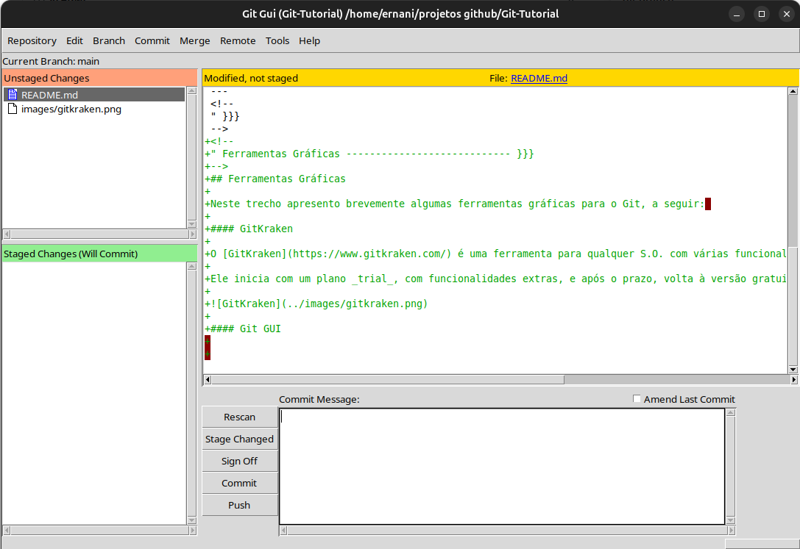

<!--
" Badges ------------------ {{{
-->
<!-- Estes badges só funcionarão quando o repositório do github for público -->
 
 
 


 
<!--
" }}}
-->
<!--
" Sumário ----------------------- {{{
-->
## Sumário

- [Introdução](#introdução)
- [Ferramentas Gráficas](#ferramentas-gráficas)

---
<!---
" }}}
-->
<!--
 " Introdução --------------------------- {{{
-->
## Introdução 

Este guia descreve os passos recomendados para criar um projeto versionado com Git, conectado ao GitHub - ideal para projetos Ansible ou qualquer outro.

<sub>[⬆](#sumário)</sub>
---
<!--
" }}}
-->
<!--
" Ferramentas Gráficas ---------------------------- {{{ 
-->
## Ferramentas Gráficas

Neste trecho apresento brevemente algumas ferramentas gráficas para o Git, a seguir: 

#### GitKraken

O [GitKraken](https://www.gitkraken.com/) é uma ferramenta para qualquer S.O. com várias funcionalidades, e por isso requer uma curva de aprendizado mais longa.  

Ele inicia com um plano _trial_, com funcionalidades extras, e após o prazo, volta à versão gratuita, ainda bem utilizável. 


#### Git GUI

O Git GUI, também funcional em vários S.O.s, vem instalado por padrão junto com o _git_. 

Para executá-lo no Linux, basta rodar ```git gui```. 

Sua interface é bem mais simples, mas tem as principais funcionalidades para gerenciar um projeto _Git_. 



---
<!--
" }}}
-->

