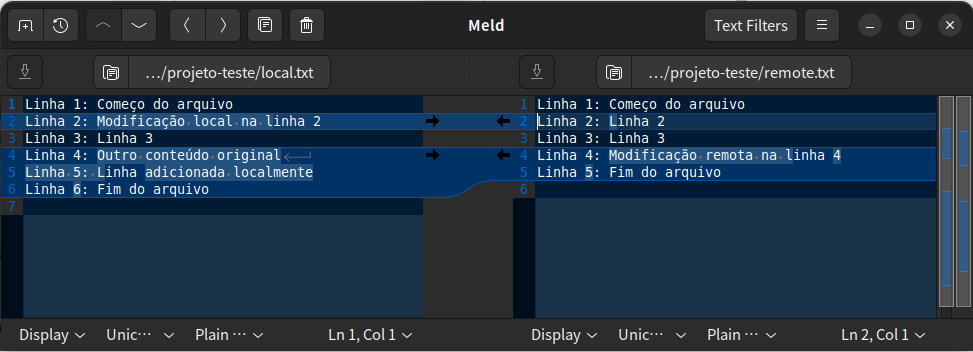

<!--
" Badges ------------------ {{{
-->
<!-- Estes badges só funcionarão quando o repositório do github for público -->
 
 
 


 
<!--
" }}}
-->
<!--
" Sumário ----------------------- {{{
-->
## Sumário

- [Introdução](#introdução)
- [Merge Tools](#merge-tools)

---
<!---
" }}}
-->
<!--
" Introdução --------------------------- {{{
-->
# Introdução 

Este guia descreve os passos recomendados para criar um projeto versionado com Git, conectado ao GitHub - ideal para projetos Ansible ou qualquer outro.

<sub>[⬆](#sumário)</sub>
---
<!--
" }}}
-->
<!--
" Merge Tools --------------------- {{{
-->
## Merge Tools

Neste tópico vou focar no uso do [P4merge](https://www.perforce.com/products/helix-core-apps/merge-diff-tool), por apresentar uma complexidade maior na resolução de conflitos de _merge_. 

##### Configuração do P4merge no _git config_:

```
 mergetool.p4merge.cmd=/home/ernani/p4v-2025.2.2796382/bin/p4merge $BASE $LOCAL $REMOTE $MERGED
 mergetool.p4merge.path=/home/ernani/p4v-2025.2.2796382/bin/
 merge.tool=p4merge
 mergetool.prompt=false
```
Como o _p4merge_ é um binário, é preciso especificar seu caminho no _path_ e _cmd_, caso contrário, apenas o parâmetro '_merge.tool=meld_' seria necessário, por exemplo.  

No parâmetro '_mergetool.p4merge.cmd_', os subparâmetros '$BASE $LOCAL $REMOTE $MERGED' se referem aos arquivos que serão abertos automaticamente, e devem aparecer nesta ordem. 

##### Layout do P4merge: 

###### Parte Superior: 

- Local (triângulo azul): versão atual local, ou _branch_ atual;
- Base (quadrado amarelo): versão comum mais antiga entre dois _branches_;
- Remote (círculo verde): versão do _branch_ que tentou fazer _merge_.

* Nenhum dos arquivos acima é diretamente editável.  

###### Parte Inferior: 

O arquivo editável, que será o resultado final do _merge_. 

###### Significados dos Símbolos: 

- Símbolos coloridos simples: indicam que aquele trecho veio diretamente daquela versão.  
- Símbolos acinzentados: indicam que a mudança __já foi aplicada__ no resultado final, ou que o trecho _não é mais conflitante_. 
- Símbolos com sinal de '+': indicam __alterações conflitantes__, ou seja, precisam de escolha manual. 

###### Resolvendo os conflitos: 

No arquivo final (parte inferior), os conflitos são mostrados com os símbolos respectivos na margem direita. Ao clicar nos símbolos, são aplicadas ou excluídas as mudanças dos arquivos respectivos. 

Caso este método traga outros trechos não desejados, pode-se fazer a edição manual do arquivo final. 


###### Alternativa para comparação simples de arquivos: 

Quando se deseja apenas comparar dois arquivos, ou alterar um com base no mesmo, localizado em outro diretório, é mais simples usar o __meld <file1> <file2>__. 

O _meld_ permite edição direta dos arquivos, e as diferenças são mostradas em linhas destacadas dos dois lados, com setas que indicam para qual arquivo enviar as diferenças. 



<sub>[⬆](#sumário)</sub> 
---
<!--
" }}}
-->


